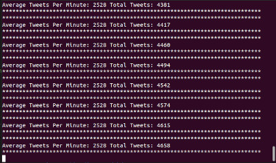

# Test Twitter API stream

There are three projects implemented using .Net Core

1. twitter-api-service project folder is for the Asp.Net Web Api service
* Exposes two endpoints: 
* https://localhost:6001/v1/twitteranalysis
* http://localhost:6000/v1/twitteranalysis
* Response Json Data:
* {"averageTweetsPerMinute":3566,"totalTweets":3613}

2. console-client project folder is for the client app to make the HTTP request call to the expose endpoint and output to the terminal.

3. twitter-api-service-test project folder for the unit test

